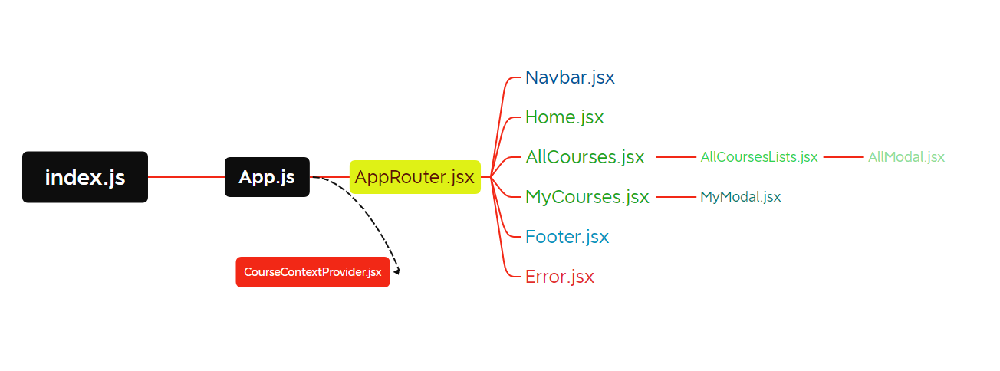

## [See the Page](https://global-ai-hub-courses-rho.vercel.app/)

- I made the project with react,
- I used css for design,
- I did not use any plugin or library other than React Router DOM in the project,
- I have specified a file (index.css) globally in css.
  - The purpose of this is to be able to easily update globally given properties (such as colors or font family).
- I opened a separate .module.css file for each component.
  - The purpose of this is that the classnames given to the tags can sometimes be mixed and be the same.
  - It can happen. In such a situation, error detection can be difficult.
  - so I used this method to avoid confusion.
- I used 2 different service links in the project

## All Courses

- At the bottom of the page, we see all courses as responsive design.
- Here we can see the details of the courses as modal.
  - Here it is directed to the link of the course.

## My Courses

- On this page, we see the courses taken by the user.
- We can see the details of the courses in modal here.

